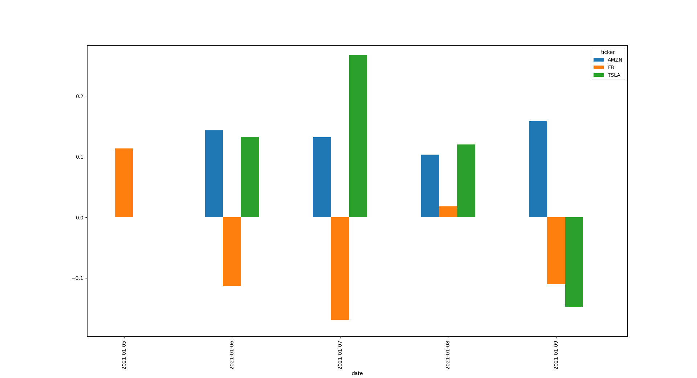

# Stock Sentiment Analysis Bot

This is a bot that can analyze the overall sentiment around a specific stock using news headlines as a gauge. The project is written in python and uses the Vader Sentiment Intensity Analyzer from the NLTK library to try and figure out the overall sentiment of a news headline, whether positive or negative. This can be used to gauge whether the stock is a good buy or not. The news headlines are scraped from finviz.com using Beautiful Soup. The final sentiment analysis of the stock ticker symbols passed into the bot are presented in the form of a bar chart. A higher bar means the stock has a positive sentiment around it and might be a good buy and a lower bar means the stock has a more negative sentiment around it and might not be a good buy

# Sample Chart

